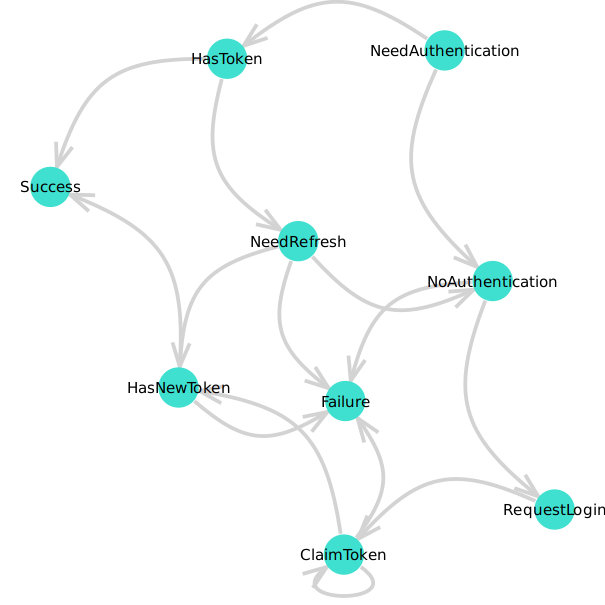

# PkgAuthentication

Authentication to private Julia package servers

```
    authenticate(pkgserver)

Starts browser based pkg-server authentication (blocking).

`pkgserver` must be a URL pointing to a server that provides the `/pkgserver/challenge`,
`/pkgserver/response`, and `/pkgserver/claimtoken` endpoints.
```

## Installation
1. Make sure PkgAuthentication.jl is part of the default Julia environment.
2. Put the following into your `startup.jl` to enable authentication for server as configured in JULIA_PKG_SERVER environment variable.
```julia
# create a new anonymous module for the init code to not pollute the global namespace
Base.eval(Module(), quote
    using PkgAuthentication
    PkgAuthentication.install()
end)
```

## Implementation

Authentication is implemented with the following state machine:


