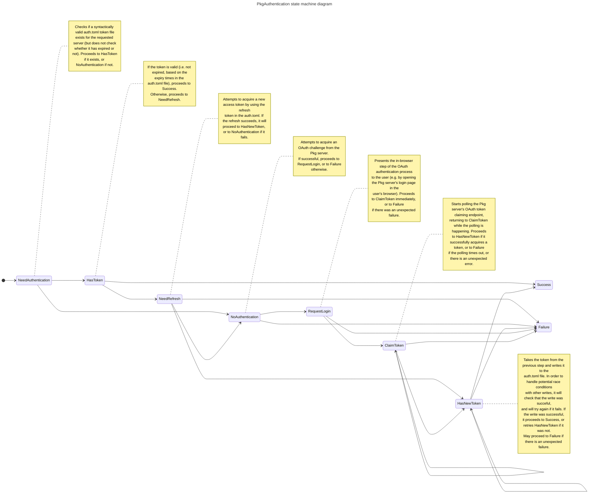

# PkgAuthentication

Interactive browser-based authentication to private Julia Pkg servers.

## Setup

#### Step 1: Make sure that PkgAuthentication.jl is installed in the default global Julia package environment (`v1.x`)

```julia
julia> delete!(ENV, "JULIA_PKG_SERVER");

julia> import Pkg

julia> Pkg.activate("v$(VERSION.major).$(VERSION.minor)"; shared = true)

julia> Pkg.add("PkgAuthentication")
```

#### Step 2: Set the `JULIA_PKG_SERVER` environment variable

One easy way to set the `JULIA_PKG_SERVER` environment variable is to add the following
line to your [`startup.jl`](https://docs.julialang.org/en/v1/manual/getting-started/) file:

```julia
ENV["JULIA_PKG_SERVER"] = "my-pkg-server.example.com"
```

#### Step 3: Put the following snippet into your [`startup.jl`](https://docs.julialang.org/en/v1/manual/getting-started/) file

```julia
# create a new anonymous module for the init code to not pollute the global namespace
Base.eval(Module(), quote
    import PkgAuthentication
    PkgAuthentication.install();
end)
```

With the above snippet, Pkg will automatically prompt you when you need to authenticate.

However, if you want to authenticate immediately (instead of waiting until the first
Pkg operation that needs authentication), you can do so as follows. First, make
sure that you have completed steps 1, 2, and 3 above. Then, open the Julia REPL
and run the following:

```julia
julia> import PkgAuthentication

julia> PkgAuthentication.authenticate();
```

## Adding new registries

If you are using this private Pkg server for the first time, you probably want to
make sure that you add any private registries that might be served by this Pkg server.

First, make sure that you have completed steps 1, 2, and 3 above. Then, open the
Julia REPL and run the following:

```julia
julia> import Pkg

julia> Pkg.Registry.add()

julia> Pkg.Registry.update()
```

## Implementation

Authentication is implemented with the following state machine:


