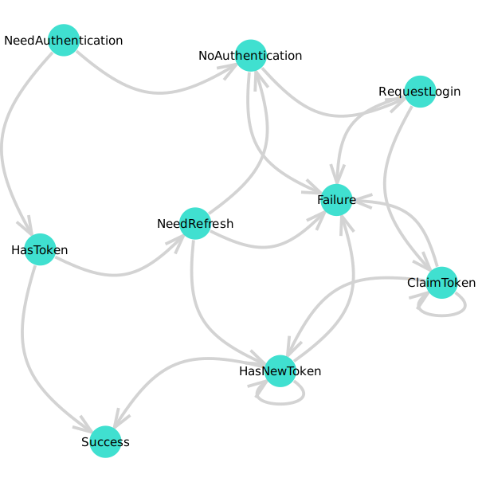

# PkgAuthentication

Authentication to private Julia package servers

```
    authenticate(pkgserver)

Starts browser based pkg-server authentication (blocking).

`pkgserver` must be a URL pointing to a server that provides the `/auth/pkgserver/challenge`,
`/auth/pkgserver/response`, and `/auth/pkgserver/claimtoken` endpoints.
```

## Example Usage

Use `PkgAuthentication.is_new_auth_mechanism()` to check if the currently installed
version of Pkg supports authentication hooks. If so, register a hook with e.g.
``````julia
function register_auth_handler(pkgserver::Union{Regex, AbstractString})
    return Pkg.PlatformEngines.register_auth_error_handler(pkgserver, (url, svr, err) -> begin
        ret = PkgAuthentication.authenticate(svr, tries = 3)
        # TODO: handle errors
    end)
end
``````

If not, start the external process at some other time, e.g. on startup.

## Implementation

Authentication is implemented with the following state machine:

