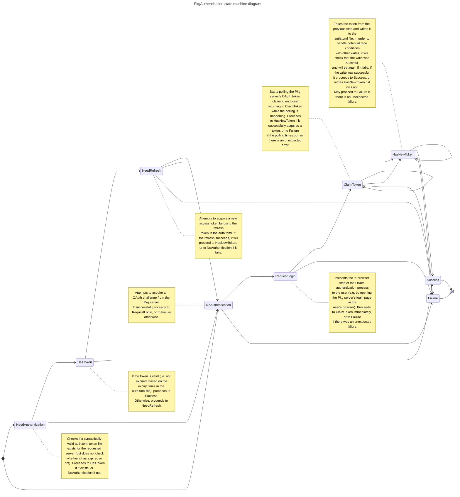

# Internal implementation notes

The authentication control flow is implemented as the following state machine, starting from the `NeedAuthentication` state (or `NoAuthentication` if `force=true` is passed to `authenticate`), and finishing in either `Success` or `Failure`.

