# Internal State Machine

The authentication control flow is implemented as the following state machine, starting from the `NeedAuthentication`
state (or `NoAuthentication` if `force=true` is passed to `authenticate`), and finishing in either `Success` or `Failure`.

```mermaid
---
title: PkgAuthentication state machine diagram
theme: 'base'
themeVariables:
    noteTextColor: '#222'
---

stateDiagram-v2

    [*] --> NeedAuthentication
    [*] --> NoAuthentication

    state state1 <<choice>>
    ClaimToken --> state1
    ClaimToken --> ClaimToken: retry
    state1 --> HasNewToken
    state1 --> Failure
    note left of ClaimToken
        Starts polling the Pkg server's OAuth token claiming
        endpoint, returning to ClaimToken while the polling is
        happening. Proceeds to HasNewToken if it successfully
        acquires a token, or to Failure if the polling times out,
        or there is an unexpected error.
    end note


    state state2 <<choice>>
    HasNewToken --> state2
    HasNewToken --> HasNewToken: retry
    state2 --> Success
    state2 --> Failure
    note left of HasNewToken
        Takes the token from the previous step and writes it to
        the auth.toml file. In order to handle potential race
        conditions with other writes, it will check that the
        write was successful, and will try again if it fails. If
        the write was successful, it proceeds to Success, or
        retries HasNewToken if it was not. May proceed to Failure
        if there is an unexpected failure.
    end note

    state state3 <<choice>>
    HasToken --> state3
    state3 --> NeedRefresh
    state3 --> Success
    note left of HasToken
        If the token is valid (i.e. not expired, based on the
        expiry times in the auth.toml file), proceeds to Success.
        Otherwise, proceeds to NeedRefresh.
    end note

    state state4 <<choice>>
    NeedAuthentication --> state4
    state4 --> HasToken
    state4 --> NoAuthentication
    note left of NeedAuthentication
        Checks if a syntactically valid auth.toml token file
        exists for the requested server (but does not check
        whether it has expired or not). Proceeds to HasToken if
        it exists, or NoAuthentication if not.
    end note

    state state5 <<choice>>
    NeedRefresh --> state5
    state5 --> HasNewToken
    state5 --> NoAuthentication
    note left of NeedRefresh
        Attempts to acquire a new access token by using the
        refresh token in the auth.toml. If the refresh succeeds,
        it will proceed to HasNewToken, or to NoAuthentication if
        it fails.
    end note

    state state6 <<choice>>
    NoAuthentication --> state6
    state6 --> RequestLogin
    state6 --> Failure
    note left of NoAuthentication
        Attempts to acquire an OAuth challenge from the Pkg
        server. If successful, proceeds to RequestLogin, or to
        Failure otherwise.
    end note

    state state7 <<choice>>
    RequestLogin --> state7
    state7 --> ClaimToken
    state7 --> Failure
    note left of RequestLogin
        Presents the in-browser step of the OAuth authentication
        process to the user (e.g. by opening the Pkg server's
        login page in the user's browser). Proceeds to ClaimToken
        immediately, or to Failure if there was an unexpected
        failure.
    end note

    Success --> [*]
    Failure --> [*]
```



> **Note** This file is automatically generated by the `bin/structure.jl` script.

## Device flow authentication

Device flow authentication enables an application to authenticate a user by providing a link that can be opened on another device where the user can proceed with authentication. The application will be able to check whether the user has completed authentication on the other device by calling certain APIs. Finally, the application can retrieve the users OAuth token via the same API call. Device flow authentication becomes necessary on devices that do not have a browser based interface for regular login or applications that are not browser based such as command line applications. More details [here](https://datatracker.ietf.org/doc/html/rfc8628).

### Working of device flow in PkgAuthentication.jl

We first call the dex [openid-configuration](https://dexidp.io/docs/openid-connect/) endpoint to determine whether the Pkg server supports device authentication. When device authentication is supported by the Pkg server we call the `/dex/device/code` endpoint. When the Pkg server does not support device authentication we fall back to the legacy browser authentication flow. The state machine for both flows are exactly the same (see diagram above). Only the http requests are different. The request and response for device code endpoint looks like:

Request:

```
curl --request POST \
    -H 'Accept: application/json' \
    -H 'Content-Type: application/x-www-form-urlencoded' \
    --data 'client_id=device&scope=openid email profile offline_access' \
    https://juliahub.com/dex/device/code
```

Response:

```json
{
   "device_code": "abcdefghijklmnopqrstuvwxyz1234567890",
   "user_code": "FJMC-LPVR",
   "verification_uri": "https://juliahub.com/dex/device",
   "verification_uri_complete": "https://juliahub.com/dex/device?user_code=FJMC-LPVR",
   "expires_in": 300,
   "interval": 5
}
```

The `verfication_uri_complete` value is opened in the browser for the user so that they can continue logging in. As in the legacy browser flow which calls `/claimtoken` to poll for completion of authentication, we call `/dex/token` when device authentication is available.

The poll request looks like:

```
curl --request POST \
    -H 'Accept: application/json' \
    -H 'Content-Type: application/x-www-form-urlencoded' \
    --data "client_id=device&scope=openid email profile offline_access&grant_type=urn:ietf:params:oauth:grant-type:device_code&device_code=$device_code" \
    https://juliahub.com/dex/token
```

While the user hasn't finished authenticating, the response will be:

```
HTTP/1.1 401 Unauthorized

{"error":"authorization_pending"}
```

Sometimes the response code might be 400.

After the user is successfully authenticated, the response will be:

```json
{
  "access_token": "abcdefghijklmnopqrstuvwxyz1234567890",
  "token_type": "bearer",
  "expires_in": 86399,
  "refresh_token": "abcdefghijklmnopqrstuvwxyz1234567890",
  "id_token": "abcdefghijklmnopqrstuvwxyz1234567890"
}
```

We generate content for the `auth.toml` file with these values. We add some extra key/values to auth.toml when device authentication is enabled:
- `client: "device"` This will help us distinguish between device authenticated auth.toml's and legacy auth.toml's. Not to be confused with `client_id` parameter that is used in the http requests. (See below)
- `expires_at: <expires_in> + <time()>` This value is required to determine whether the token is expired and needs refresh. This is missing in the token response so we add it by summing the `expires_in` in value with the current timestamp.
- `refresh_url` This value is also missing in the device token response but is necessary for refreshing expired tokens. We create this field with value `<server>/auth/renew/token.toml/device/`.

The mechanism to refresh the token is the same as in the legacy browser authentication flow.

### Client ID for device authentication flow

The `client_id` parameter for device authentication can be configured by setting the environment variable `JULIA_PKG_AUTHENTICATION_DEVICE_CLIENT_ID`. This value defaults to `"device"`.
